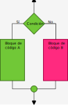
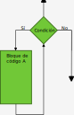

# Tema 2.6: Estructuras de control

En Java hay tres sentencias de control:

* Condicionales: Se determina la ejecución de cierto código fuente dependiendo de una condición:
  * `if else` / `else if`
  * `switch`
* Repetitiva: Se repetirá una secuencia de código tantas veces como se indique o hasta que se cumpla (o deje de cumplirse) una condición:
  * `for`
  * `while`
  * `do ... while`
* Salto incondicional: Se utilizan principalmente para **saltar** o **salir** de la ejecución de una **iteración** de un **bucle**:
  * `break`: Interrumpe la ejecución.
  * `continue`: Salta hasta la siguiente iteración.

A una estructura de control repetitiva se la llama también **bucle**.

Cada una de las veces que se ejecuta el código de un **bucle** se dice que se ha producido una **iteración**.

## Estructuras condicionales

### `if else` / `else if`



Esta estructura permitirá que se ejecute un bloque de código u otro dependiendo de la condición.

Veámoslo con un ejemplo:

```java
if (age >= 18) {
    // Bloque de código A.
    System.out.println("Eres mayor de edad.");
} else {
    // Bloque de código B.
    System.out.println("Eres menor de edad.");
}
```

#### Variantes

Una variante sería **omitir** la rama del **else**:

```java
if (age < 18) {
    System.out.println("Eres menor.");
}
```

Otra variante consiste en **anidar ifs**:

```java
if (edad < 12) {
    System.out.println("Eres muy joven para la peli.");
} else if (edad >= 12 && edad < 18) {
    System.out.println("Esta peli es para ti.");
} else {
    System.out.println("Eres muy viejo para la peli.");
}
```

### `switch`

La instrucción **switch** se puede realizar mediante **if else** consecutivos. La idea es que **switch** sea más legible.

La sintaxis de switch es la siguiente:

```java
switch (valor_a_comparar) {
    case valor_de_comparación_1:
        // Código a ejecutar si valor_a_comparar == valor_de_comparación_1.
        break;
    case valor_de_comparación_2:
        // Código a ejecutar si valor_a_comparar == valor_de_comparación_2.
        break;
    default: // Opcional.
        // Código a ejecutar en caso de que se haya cumplido ninguna de las igualdades anteriores.
}
```

Un ejemplo del uso de **switch** sería:

```java
Console c = System.console();

System.out.print("Introduzca un número entre 1 y 3: ");
int value = Integer.parseInt(c.readLine());

switch (value) {
    case 1: 
        System.out.println("El número introducido fue uno.");
        break;
    case 2:
        System.out.println("El número introducido fue dos.");
        break;
    case 3:
        System.out.println("El número introducido fue tres.");
        break;
    default:
        System.out.println("El número introducido no estaba entre 1 y 3.");
}
```

## Estructuras repetitivas (estructuras iterativas o bucles)

Estas estructuras determinan cuantas veces ha de repetirse un bloque de código. Puede indicarse un número fijo de repeticiones, como es el caso del `for` o establecer una condición para la repetición como es el caso del `while` y el `do while`.



### `for`

El bucle `for` tiene la siguiente sintaxis:

```java
for (<sentencia>; <condición>; <modificación de la condición>) {
    // Bloque de código a repetir
}
```

así, un bucle **for** que muestre los números del 1 al 100 sería:

```java
for (int i = 1; i <= 100; i += 1) {
    System.out.println(i);
}
```

### `while`

El bucle `while` tiene la siguiente sintaxis:

```java
while (<condición>) {
    // Bloque a repetir mientras se cumpla la condición.
}
```

El mismo código que muestre los números del 1 al 100 con un bucle **while** sería:

```java
int i = 1;
while (i <= 100) {
    System.out.println(i);
    i = i + 1;
}
```

### `do while`

La única diferencia con los bucles anteriores es que en este **siempre se ejecuta el bloque de código** al menos **una vez**:

Su sintaxis es la siguiente:

```java
do {
    // Bloque a repetir
} while (<condición>);
```

El mismo ejemplo de los casos anteriores con un bucle **do while** sería:

```java
int i = 0;

do {
    System.out.println(++i);
} while (i < 100);
```

### Bucle `for`

El bucle for está pensado para repetir un bloque de instrucciones un número fijo de veces que conocemos de antemano. Por ejemplo, tantas veces como elementos tenga un array.

#### Sintaxis

```java
for ((primera sentencia); (segunda sentencia); (tercera sentencia)) {
    // Bloque de código a repetir.
}
```

Cada _sentencia_ será un bloque de código con el contenido que se indica a a continuación.

##### primera sentencia

Esta sentencia se ejecuta únicamente **una vez** antes de iniciar el bucle. Normalmente se declara y se le da valor a una variable que irá modificándose con cada iteración del bucle.

##### condición de continuación

Mientras se cumpla la condición indicada en esta sección el bucle seguirá repitiéndose. Normalmente es una comparación respecto a la variable declarada en la **primera sentencia**.

##### segunda sentencia

Esta sentencia se ejecutará **cada vez que se ejecute una iteración** del bucle. Normalmente modifica el valor de la variable declarada en la **primera sentencia** de modo que se acerque cada vez más al fin del bucle (a que la **condición de continuación** deje de cumplirse).

Un ejemplo con código real sería el siguiente:

```java
for (int i = 0; i < 100; i++) {
    // Mostremos una línea de texto por cada iteración del bucle.
    System.out.println("Iteración número " + i);
}
```

1. En la primera sentencia `int i = 0;` declaramos y le damos un valor inicial a la variable `i`.
2. En la segunda sentencia establecemos la condición de terminación del bucle: `i < 100`: el bucle se repetirá mientras sea cierto que `i` es menor que `100`.
3. En la tercera sentencia `++i` el valor la variable `i` se incrementa de manera que nos vayamos acercando a la condición de terminación.

### Sentencias `break` y `continue`

En algunos casos es necesario **alterar** el normal funcionamiento de un bucle.

Imaginemos que normalmente un bucle se ejecutará diez veces pero que deseamos que termine si el usuario introduce un valor que no sea válido. Para **forzar la terminación** del bucle, es decir, para _romper_ la repetición usaremos la sentencia `break`.

En otros casos puede que no deseamos terminar el bucle definitivamente pero sí deseamos saltar el resto del código y pasar a la siguiente iteración (o repetición) del bucle. Para ello hemos de usar la sentencia `continue`.

#### `break`

Veamos algunos ejemplos del funcionamiento de la sentencia `break` de terminación de un bucle:

Si deseamos terminar el bucle si encontramos el valor que no sea válido:

```java
do {
    // Imaginemos que hay un método que genera un valor.
    int valor = generaValor();
    
    // El método "esValido" devolverá "true" o "false" dependiendo de si el valor es o no válido.
    if (!esValido(valor)) {
        // Si el valor es no válido salimos fuera del bucle.
        break;
    }

    // Código para procesar el valor.
    // ...

} while (true);
// Código exterior al bucle.
// ...
```

#### `continue`

Veamos algunos ejemplos del funcionamiento de la sentencia `continue` de salto a la siguiente iteración de un bucle:

Si quisiésemos crear un bucle que se saltase las iteraciones múltiplo de tres podríamos escribir:

```java
for (int i = 0; i < 10; ++i) {
    if (i % 3 == 0) {
        continue; // No saltamos todo el código hasta el principio del siguiente bucle.
    }

    System.out.println("Iteración número " + i + ".");
}
```

### Formas de terminar un bucle

Todo bucle (en general) debería de disponer de algún mecanismo de terminación. Así, los bucles `while` y `do while` se repetirían mientras se cumpla una condición y el bucle `for` (y el **for-each**) se repetirían un número predeterminado de veces.

No obstante a veces es conveniente terminar un bucle antes de que se alcance la condición de terminación _estándar_. Para ello disponemos de varios métodos:

* Podemos usar la sentencia que acabamos de ver `break`. Que nos _moverá_ a la primera sentencia exterior al bucle.
* Otra forma de terminar (si estamos dentro de un método) es _retornar el resultado_ del método utilizando la sentencia `return`.
* Finalmente otra forma de terminar un bucle es terminar la ejecución del programa mediante la sentencia `System.exit(0)`.

Un ejemplo de la conveniencia de terminación anticipada de un bucle es cuando estamos comprobando si un valor se encuentra en un array. Para ello, en principio, hemos de recorrer todo el array comprobando posición a posición (imaginemos un array no ordenado).
Pero una vez hayamos encontrado el elemento no necesitamos seguir comprobando el resto de elementos del array. Así un método que compruebe si un array contiene un elemento podría ser:

```java
public static boolean contains(Object[] arr, Object buscado) {
    for (Object obj : arr) {
        // Si encontramos dos objetos iguales retornamos true 
        // (el objeto buscado está en el array).
        if (obj.equals(buscado)) return true;
    }
    // Si hemos recorrido todo el array y no hemos encontrado el objeto
    // buscado retornamos false.
    return false;
}
```
