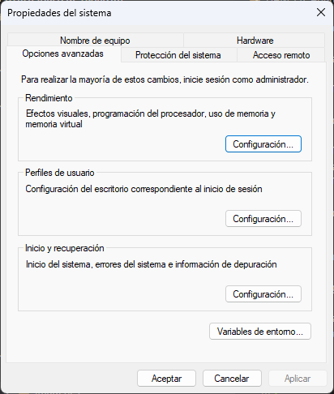
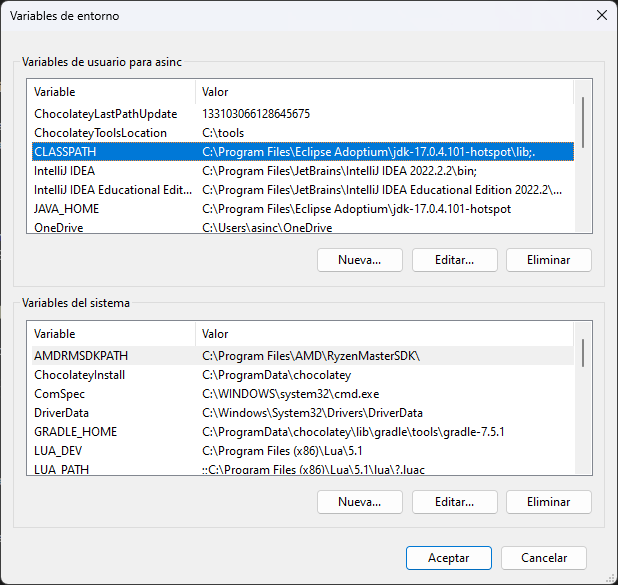
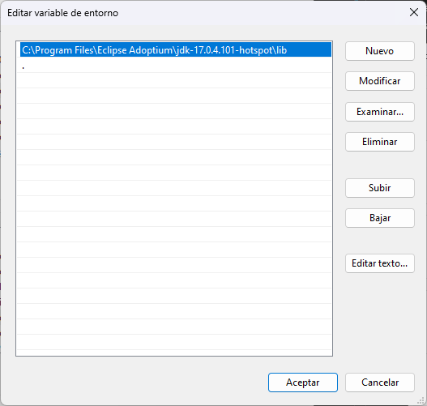

# Tema 3.4: Paquetes

En Java los paquetes son un mecanismo mediante el que podemos agrupar clases, sub-paquetes e interfaces. Como es lógico se agruparán en un mismo paquete aquellas clases que tengan alguna relación entre ellas.

Toda clase (e interfaz) pertenece a algún paquete. Si no se indica explícitamente uno (mediante la sentencia `package`) se asigna la clase a un paquete por defecto.

Los paquetes se usan para:

* Facilitar la localización de las clases e interfaces.
* Evitar conflictos de nombres, es decir, podrían existir dos clases Alumno en dos paquetes distintos (uno perteneciendo al instituto y otro a una academia).
* Facilitan un control de acceso: `protected` y el acceso por defecto funcionan a nivel de paquete.

Hemos de tener en cuenta también que los paquetes están relacionados con la estructura de directorios. Así que si una clase está en el paquete `org.iescotarelo.dam` estará guardada en el directorio `org\iescotarelo\dam`. Idea

## Agrupar clases en paquetes

Para agrupar las clases en paquetes hemos de usar la sentencia `package`:

```java
package org.iescotarelo.dam;
```

Además hemos de tener en cuenta que la clase ha de guardarse en la ruta `org\iescotarelo\dam`.

## Paquetes y el CLASSPATH y el horror

La variable de entorno `CLASSPATH` le indicará a la JVM dónde debe buscar los paquetes a los que llamamos o deseamos importar.
De este modo, si todos nuestros paquetes están dentro del directorio `C:\FP\DAM\Programacion\Java` deberíamos añadir dicho directorio a la variable `CLASSPATH`.

### Windows 11

Para modificar las variables de entorno en Windows 11 podemos directamente pulsar en Inicio y buscar "variables". Nos aparecerá la opción de "Editar las variables de entorno del sistema". Pulsamos y veremos la siguiente ventana:



Pulando en el botón de la parte inferior con la etiqueta `Variables de entorno...` abriremos la ventana:



Seleccionamos la variable llamada `CLASSPATH` y pulsamos editar:



Si deseamos que se incluyesen las de nuestro proyecto deberíamos añadir la ruta a la carpeta **raíz** de nuestro código.

### Cosas a tener en cuenta

Pequeños detalles *obvios* y *de escasa importancia* que nos pueden amargar una mañana.

* La variable global `CLASSPATH` ha de indicar la ruta a los directorios de classes `.class` y/o a la raíz del árbol de paquetes.
* La opción `-cp` de `java` y `javac` substituye el valor de `CLASSPATH`.
* Si incluimos `.jar` en nuestro proyecto estos han de incluirse explícitamente en el `CLASSPATH` o la opción `-cp`. **No llega co indicar su ubicación.**

## Importando clases de paquetes

Una vez tenemos nuestras clases organizadas en paquetes podremos incluirlas en nuestros programas y proyectos **importándolas**.

Para importar una o varias clases hemos de usar la sentencia `import`:

```java
import org.iescotarelo.dam.MiClase;
```

Si quisiésemos importar **todas las clases** de un paquete escribiríamos:

```java
import org.iescotarelo.dam.*;
```

La sentencia anterior importaría a nuestro programa todas las clases que se encuentren dentro del paquete `org.iescotarelo.dam`.

### Static import

Un tipo especial de import es el import estático. Este import permitirá importar a nuestro código las constantes, propiedades y métodos estáticos de la clase que indiquemos:

```java
package org.iescotarelo.dam.programacion.paquetes;

public class MiClase {
    public static final int MI_CONSTANTE = 666;

    public static void saludo(String nombre) {
        System.out.println(String.format("Hola %s."));
    }
}
```

```java
import static org.iescotarelo.dam.programacion.paquetes.MiClase;

public class MiOtraClase {
    public static void main {
        saludo("Manuel");
    }
}
```

## Estructura de directorios

Important points:

Every class is part of some package.
If no package is specified, the classes in the file goes into a special unnamed package (the same unnamed package for all files).
All classes/interfaces in a file are part of the same package. Multiple files can specify the same package name.
If package name is specified, the file must be in a subdirectory called name (i.e., the directory name must match the package name).
We can access public classes in another (named) package using: package-name.class-name

Información tomada de [GeeksForGeeks](https://www.geeksforgeeks.org/packages-in-java/).
