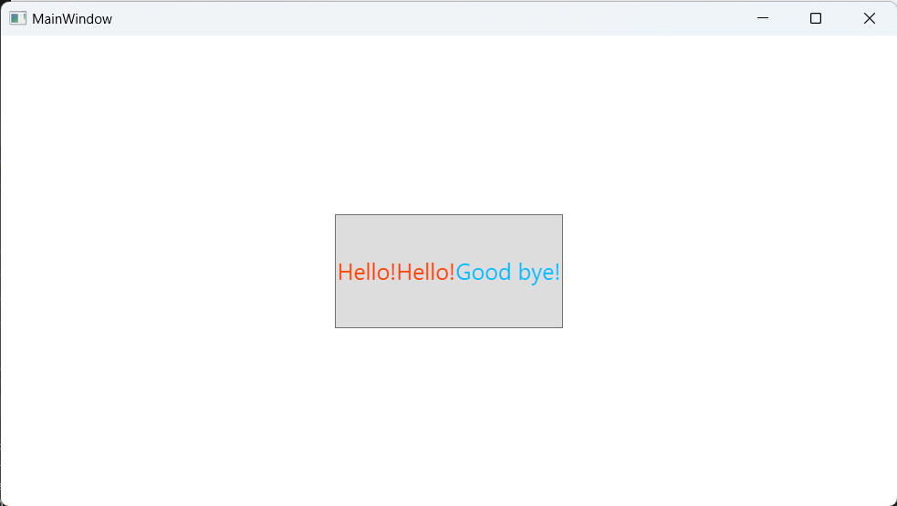
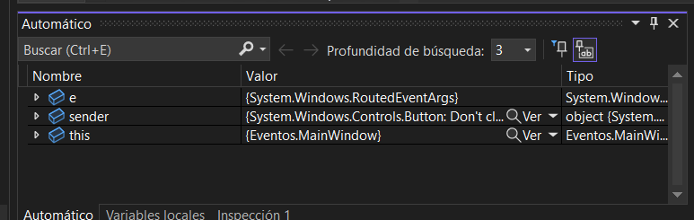
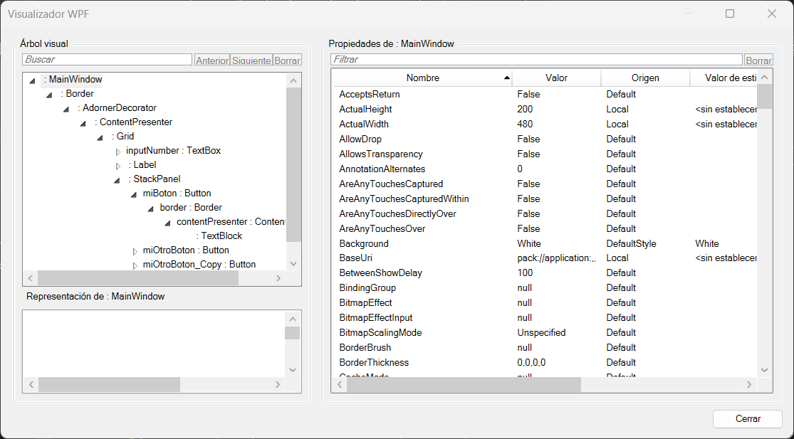

# Tema 11.0: Introducción a WPF

## ¿Qué es WPF?

WPF son las siglas de Windows Presentation Foundation. Consiste en un **framework de interfaz de usuario** que permite crear aplicaciones de escritorio.

WPF es parte del _framework_ .NET.

WPF utiliza el lenguaje de marcas XAML [^1] para definir la interfaz de usuario de manera **declarativa**.

[^1]: Extensible Application Markup Language.

También es posible crear la interfaz de usuario mediante código C# o, lo que es lo mismo, de manera programática.

## ¿Qué es XAML?

XAML[^2] es un lenguaje declarativo de marcas que permite definir la interfaz de usuario de una aplicación de escritorio.

[^2]: Extensible Application Markup Language.

La sintaxis de XAML es XML con las limitaciones propias de los elementos y propiedades que existen en el contexto de una aplicación.

**NOTA:** **xmlns** son las siglas de **XML Name Space**. Es un mecanismo que permite definir un espacio de nombres para los elementos de un documento XML.

## Primeros pasos con WPF

### Crear un elemento: botón

Para crear un elemento en XAML debemos indicar el tipo de elemento que queremos crear y sus propiedades.

En el caso de un botón el elemento es `<Button>` y la propiedad es `Content` que es la que define el texto que aparece en el botón.

``` xml
<Button Content="Botón" />
```

Otra forma de crear un botón es abriendo y cerrando el elemento `<Button>` y añadiendo en su interior los elementos que representen la propiedad que deseamos modificar.

``` xml
<Button>
    <Button.Content>
        Botón
    </Button.Content>
</Button>
```

### El botón de manera programática

Si nos fijamos en el explorador de soluciones podemos ver que el elemento **MainWindow.xaml** se puede desplegar y que dentro tiene un elemento **MainWindow.xaml.cs** asociado.

Dentro de este archivo de código fuente de C# podemos ver que hay una clase `MainWindow` que hereda de `Window` y que tiene un método `InitializeComponent()`.

El método constructor de la clase `MainWindow` tiene una función similar al método `Main()` de un programa de consola. Es el punto de entrada de la aplicación y el encargado de inicializar la interfaz de usuario.

Dentro de este método se llama al método `InitializeComponent()` que es el encargado de crear la interfaz de usuario.

A continuación nosotros podríamos crear a mano la interfaz de usuario de la aplicación.

Para ello lo primero que necesitaríamos es un objeto `Grid` (dentro del cual se posicionarán los demás elementos):

``` csharp
Grid grid = new Grid();
This.Content = grid;
```

Si queremos añadir un botón a la interfaz de usuario lo podemos hacer de la siguiente manera:

``` C#
Button button = new Button();
button.Content = "Botón";

grid.Children.Add(button);
```

#### Ejemplo más grande

En este ejemplos pondremos un botón dentro de la ventana y dentro introduciremos text bloques de texto con diferentes colores.

En primero lugar veremos como se representa en XAML:

``` xml
<Grid HorizontalAlignment="Center" VerticalAlignment="Center">
    <Button>
        <Button.FontSize>24</Button.FontSize>
        <Button.Width>200</Button.Width>
        <Button.Height>100</Button.Height>
        <Button.Content>
            <WrapPanel>
                <TextBlock Foreground="AliceBlue">Uno</TextBlock>
                <TextBlock Foreground="Coral">Uno</TextBlock>
                <TextBlock Foreground="Turquoise">Uno</TextBlock>
            </WrapPanel>
        </Button.Content>
    </Button>
</Grid>
```

Si quisiéramos hacer lo mismo de manera programática sería de la siguiente manera:

``` C#
public partial class MainWindow : Window
{
    public MainWindow()
    {
        InitializeComponent();
        Grid grid = new Grid();

        this.Content = grid;

        Button btn = new Button();
        btn.Width = 200;
        btn.Height = 100;
        btn.FontSize = 20;

        WrapPanel wp = new WrapPanel();

        TextBlock tb1 = new TextBlock();
        tb1.Text = "Hello!";
        tb1.Foreground = Brushes.OrangeRed;

        TextBlock tb2 = new TextBlock();
        tb2.Text = "Hello!";
        tb2.Foreground = Brushes.OrangeRed;

        TextBlock tb3 = new TextBlock();
        tb3.Text = "Good bye!";
        tb3.Foreground = Brushes.DeepSkyBlue;

        wp.Children.Add(tb1);
        wp.Children.Add(tb2);
        wp.Children.Add(tb3);

        btn.Content = wp;

        grid.Children.Add(btn);
    }
}
```

En cualquier caso el resultado sería el mismo:



## Árbol de elementos

Se puede decir que un elemento o un conjunto de elementos tiene dos árboles:

- **Árbol lógico:** Es el árbol de elementos que se representa en el código de la aplicación (XAML o C#).
- **Árbol visual:** Es el árbol de elementos que se representa en la interfaz de usuario.

El árbol visual, además de los elementos que se ven en el árbol lógico tiene otros muchos elementos ya que cada elemento como una lista o un botón está compuesto por otros elementos. Así un botón está compuesto por un borde que contiene un `ContentPresenter` y este a su vez contiene un `TextBlock`.

Para acceder al árbol visual de una aplicación podemos hacerlo estableciendo un _breackpoint_ en algún método de nuestra aplicación (por ejemplo el método handler del botón), lanzar la aplicación y luego el cuadro de elementos de la ventana seleccionar la lupa y hacer click en el botón `Visualizador WPF`.

Al pausar la ejecución de la aplicación después de lanzar un evento podremos ver esta ventana:



Si pulsamos sobre la lupa aparecerá la opción `Visualizador WPF` y si pulsamos sobre ella se abrirá una ventana con el árbol visual de la aplicación:



Como podremos ver al ir desplegando el árbol hay muchos elementos que están compuestos por otros:

