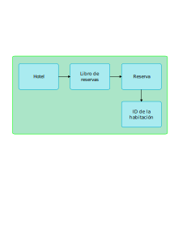
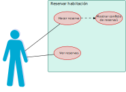

# Tema 11.2: MVVM[^1]

## ¿Qué es MVVM?

MVVM es patrón de diseño de software que se utiliza para separar la interfaz de usuario de la lógica de negocio. MVVM tambén es conocido como _model-view-binder_ que se traduciría como modelo-y-vista-enlazados y fue creado por los ingenieros de Microsoft Ken Cooper y John Gossman sobre el año 2004.

La idea principal de MVVM es que la interfaz de usuario (la vista) no tiene que conocer la lógica de negocio (el modelo) y que la lógica de negocio no tiene que conocer la interfaz de usuario.

La segunda característica de MVVM es que la vista y el modelo se enlazan de manera automática. Esto quiere decir que cuando el modelo cambia la vista se actualiza automáticamente y viceversa.

[^1]: Model-View-ViewModel

### ¿Qué es la vista?

La vista es la interfaz que se muestra al usuario. En WPF la vista es un árbol de elementos que se representa en el código XAML o en el código C#.

### ¿Qué es el modelo?

El modelo es la lógica de negocio de la aplicación. En WPF el modelo es un conjunto de clases que representan los datos de la aplicación y las relaciones entre ellos.

### ¿Qué es el ViewModel?

TODO: TEXTO CREADO POR EL COPILOT

El ViewModel es un objeto que se encarga de enlazar la vista y el modelo. En WPF el ViewModel es una clase que implementa la interfaz `INotifyPropertyChanged` y que tiene propiedades que representan los datos que se muestran en la vista.

## Ejemplo de MVVM

Para ver como funciona MVVM vamos a crear una aplicación empezando por el modelo y luego creando la vista y el ViewModel.

### Crear el modelo

El modelo representa el sistema de reservas de un hotel. Constará de cuatro clases:

- `Hotel`: Representa el hotel.
- `LibroDeReservas`: Representa el libro de reservas del hotel.
- `Reserva`: Representa una reserva.
- `IDHabitacion`: Representa el identificador de una habitación.



#### Clase `Hotel`

``` csharp
```

#### Clase `LibroDeReservas`

``` csharp
```

#### Clase `Reserva`

``` csharp
```

#### Clase `IDHabitacion`

``` csharp
```

### Analizar el caso de uso

Hay dos casos de uso que vamos a implementar en la aplicación:

- Ver las reservas de un día. Este es el más sencillo pues es únicamente de consulta. El usuario introduce una fecha y la aplicación muestra las reservas de ese día.

- Crear una reserva. El usuario introduce los datos de la reserva y la aplicación la crea. Éste es más complicado pues además de introducir los datos de la reserva hay que comprobar que la habitación está libre.


