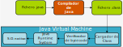

# Tema 2: Introducción a Java

## Hola mundo

### ¿Cómo escribir un programa Java?

Un programa en código Java no es más que un documento de texto con sentencias y sintaxis de Java que puedan ser comprendidas por el compilador.

Este fichero de código fuente ha de tener la extensión `.java` para que pueda ser reconocido por los IDE (Entornos integrados de desarrollo).

Así, para crear nuestro primer programa Java lo único que hemos de hacer es escribir las siguientes líneas de código en un fichero **de nombre `HolaMundo.java`** (es necesario el nombre `HolaMundo` como explicaremos más adelante):

```java
public class HolaMundo {
    public static void main(String[] args) {
        System.out.println("Hola mundo.");
    }
}
```

### ¿Cómo compilar / ejecutar un programa?

#### ¿Qué significa compilar?

Compilar un programa consiste en *convertir* el **código fuente** en **código binario**. El código fuente es el programa tal como nosotros lo hemos escrito en el editor de código, de manera que es legible por los seres humanos. Por el contrario el **código binario** *normalmente* es únicamente comprensible por el **Sistema Operativo** que puede procesarlo y enviarlo al procesador del ordenador para que se ejecuten las instrucciones que escribió el programador.

Como podemos ver el **código binario (o simplemente binario)** de un programa es dependiente del **sistema operativo** y el tipo de **procesado**r (arquitectura) de la máquina en la que se quiera ejecutar.

En Java este proceso es algo diferente. En lugar de compilar para un sistema operativo / arquitectura lo que hace el compilador de Java es crear un binario para ser ejecutado en la **máquina virtual de java (JVM)**. Esta *máquina virtual de java* no es más que un programa que entiende el código binario de Java (Java bytecode).

De modo que un programa Java, una vez compilado, podrá ser ejecutado por **cualquier JVM**. Lo que necesitaremos para poder ejecutar un **bytecode** de Java en cualquier arquitectura es una **JVM** que corra sobre ella.



#### Entonces... para ejecutar un programa Java ¿Qué?

Para ejecutar un programa Java hemos de seguir los siguientes pasos:

1. Compilar a bytecode de Java: `javac -verbose HolaMundo.java`.
2. Enviarle el bytecode de Java (`HolaMundo.class`) a la máquina virtual: `java HolaMundo`.

**Nota:** al ejecutar el segundo paso **no se ha de incluir el .class** al indicar la clase que queremos ejecutar.

#### Codificación de texto y compilación

Cuando tenemos un fichero de código fuente podemos verlo como un fichero que contiene texto. Pero en informática el texto, como cualquier otro contenido: audio, video, imágenes, gráficos, etc. estará codificado en binario. Y al igual que el audio o el vídeo hay distintos tipos de codificación.

El programa `javac`,  compilador de java, por defecto interpreta que los archivos de texto `.java` que le pasamos están codificados en el formato `ASCII` por lo que, si tenemos tildes o "ñ" en nuestro código este se mostrará incorrectamente (`ASCII` no soporta tildes ni caracteres distintos de los número y el alfabeto inglés) al ejecutarlo. Por ejemplo, si tenemos un archivo (codificado en [unicode](https://en.wikipedia.org/wiki/Unicode)) con el siguiente código fuente:

```java
public Class MiClase {
    public static void main(String[] args) {
        System.out.println("España es así.");
    }
}
```

y lo compilamos con: `javac .\MiClase.java`.

Obtendremos la clase `MiClase.class`, que al ejecutar con el comando `java MiClase` mostrará por pantalla `España es así.`.

Para corregir esto hemos de indicarle al compilador que nuestro código fuente está codificado con formato [unicode](https://en.wikipedia.org/wiki/Unicode) de la siguiente manera: `javac -encoding utf8 MiClase.java`.
Si a continuación ejecutamos el programa:

```bash
java MiClase
España es así.
```

#### Clases, JARs, `CLASSPATH` y otras cosas de meter

Cuando empecemos a programar usando el modelo de orientación a objetos nos encontraremos creado *librerías* para nuestro proyecto, así como utilizando librerías de terceros. Para que `javac` y luego `java` puedan localizar las librerías que utilizamos (en definitiva los archivos `.class`) hemos de indicárselo y para ello disponemos de dos formas (cada una con sus cosas):

* Variable de entorno `CLASSPATH`. **NO RECOMENDABLE.**
* Opciones `-cp`, `-classpath` o `-class-path` (son sinónimos) tanto para `javac` como para `java`.

##### Variable `CLASSPATH`

La variable `CLASSPATH` contendrá una lista de uno o más directorios. Estos directorios son en los que `javac` y `java` buscarán las clases que indiquemos en las sentencias `import` de nuestro código. Comúnmente hemos de indicar el directorio `lib` de nuestra instalación de JDK (`C:\Program Files\Eclipse Adoptium\jdk-17.0.4.101-hotspot\lib` en nuestro caso), también añadiremos el directorio actual `.` para que se puedan encontrar las clases de nuestro directorio. Además deberemos de indicar el directorio a donde vayamos a guardar las clases de terceros / librerías que vayamos a utilizar.

Si hacemos esto *en principio no deberíamos de tener **ningún problema... NINGÚN PROBLEMA*** (JA JA JA JA JA...).

##### Opción `-cp`

La opción `-cp` *sobrescribe* a `CLASSPATH`. De manera que si usamos `-cp` el valor que tenga `CLASSPATH` será irrelevante.
Con esta opción indicamos explícitamente los directorios donde se encontrarán las clases que usamos en nuestro proyecto.

La sintaxis en la siguiente:

* Linux: `-cp <directorio de clases 1>:<directorio de clases 2>:...`.
* Windows `-cp <directorio de clases 1>;<directorio de clases 2>;...`.

Nótese la diferencia en el separador de directorios ":" en sistemas Linux y ";" en Windows.

Además de esto es conveniente entrecomillar la lista:

```bash
javac -cp './lib;.' ./MiClase.java
```

##### [Whiskey in the JARs](https://youtu.be/wsrvmNtWU4E)

Los archivos `.jar` consisten fundamentalmente en la estructura de directorios-paquetes de un conjunto de clases de Java (= librerías).
Lo más importante que hemos de tener en cuenta es que, a efectos del **CLASSPATH** y la opción **-cp**, **un JAR  es un directorio**.

Repito.

**UN .jar CUENTA COMO SI FUESE UN DIRECTORIO.**

Esto implica que si hemos descargado un archivo `jar` de terceros para usar en nuestro proyecto hemos de realizar alguna de las siguientes acciones:

* Añadirlo a nuestra variable `CLASSPATH` (`CLASSPATH=C:\libs\libreria_descargada1.jar;C:\libs\libreria_descargada2.jar`).
* Indicarlo explícitamente en la opción `-cp`: `-cp 'C:\libs\libreria_descargada.jar;.`.
* Descomprimirla dentro de un directorio incluido en `CLASSPATH` o `-cp`.
* O decirle a nuestro EID que lo incluya. **LA MÁS RECOMENDABLE**.

## Comentarios

Cuando escribamos código en cualquier lenguaje hemos de tener presente que no seremos únicamente nosotros los que tendremos que entender y posiblemente modificar ese código. Para ello, cuando estimemos que algo puede ser confuso (para nuestro yo futuro o para otra persona), es conveniente **comentar el código**.

En Java hay tres tipos de comentarios:

* Comentario de una línea: Se indica escribiendo `//` antes de comenzar a escribir el comentario.
  
  ```java
  int a = 10;
  int b = 10;
  int c = a + b; // Esto no hace falta ni comentarlo.
  ```

* Comentario de varias líneas: Se indica escribiendo `/*` al comienzo de las líneas de comentario y `*/` al final:
  
  ```java
  /* Y esto es un ejemplo de como se puede escribir un comentario
  que se extienda varias líneas. */
  String str = "Hola mundo";
  System.out.println(str);
  ```

* Comentarios para **Javadoc**: Los comentarios para Javadoc son similares a los comentarios para varias líneas pero comienzan con `/**` en lugar de `/*`.
