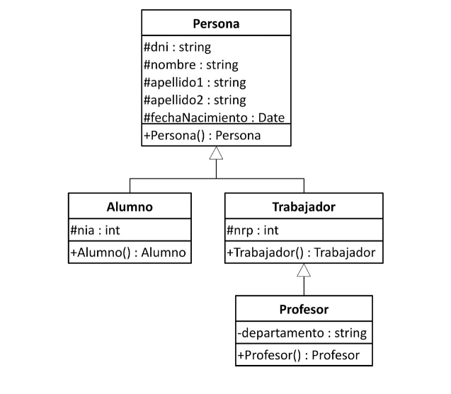

# Tema 5: Ejercicios

## Ejercicio 1

Codifica la jerarquía ser vivo, animal y vegetal, creando las estructuras que consideres necesario para almacenar de cada elemento, como mínimo, nombre científico y nombre común. Para los animales almacenaremos peso y altura. Paralos vegetales únicamente altura. Cada ser vivo se alimentará de una manera diferente, por lo que deberá reflejar este aspecto de alguna forma.

## Ejercicio 2

Implementa el escenario propuesto en la figura y añade las declaraciones de los getters y setters para cada uno de los campos, así como constructores parametrizados a cada una de las clases.

## Ejercicio 3

Si se desea manejar información sobre, únicamente, las figuras geométricas punto, recta y circunferencia, ¿qué tipo de relación establecería entre ellas? Justifica tu respuesta.

Codifica la solución que hayas propuesto junto con un programa que muestre  un menú que permita crear los tres objetos de las clases indicadas y mostrar la información de los mismos.

## Ejercicio 4

Haz una clase llamada `Persona` que siga las siguientes condiciones:

Sus atributos son: 

* nombre
* edad
* DNI
* sexo (H hombre, M mujer)
* peso
* altura

No queremos que se accedan directamente a ellos. Si quieres añadir algún atributo puedes hacerlo.

Todos los atributos menos el DNI serán valores por defecto según su tipo (0 números, cadena vacía para String, etc.). Sexo sera hombre por defecto, (usa una constante para representar el sexo).

Se implantaran varios constructores:

* Un constructor por defecto.
* Un constructor con el nombre, edad y sexo, el resto por defecto.
* Un constructor con todos los atributos como parámetro.

Los métodos que se implementaran son:

* `calcularIMC()`: calculara si la persona esta en su peso ideal (peso en kg/(altura^2  en m)), si esta fórmula devuelve un valor menor que 20, la función devuelve un -1, si devuelve un número entre 20 y 25 (incluidos), significa que esta por debajo de su peso ideal la función devuelve un 0  y si devuelve un valor mayor que 25 significa que tiene sobrepeso, la función devuelve un 1. Te recomiendo que uses constantes para devolver estos valores.
* `esMayorDeEdad()`: indica si es mayor de edad, devuelve un booleano.
* `comprobarSexo(char sexo)`: comprueba que el sexo introducido es correcto. Si no es correcto, sera H. No sera visible al exterior.
* `generaDNI()`: genera un número aleatorio de 8 cifras, genera a partir de este su número su letra correspondiente. Este método sera invocado cuando se construya el objeto. Puedes dividir el método para que te sea más fácil. No será visible al exterior.
* `toString()`: devuelve una cadena respresentado las propiedades del objeto.
* Métodos set de cada parámetro, excepto de DNI.

Ahora, crea una clase ejecutable que haga lo siguiente:

* Pide por teclado el nombre, la edad, sexo, peso y altura.
* Crea 3 objetos de la clase anterior, el primer objeto obtendrá las anteriores variables pedidas por teclado, el segundo objeto obtendrá todos los anteriores menos el peso y la altura y el último por defecto, para este último utiliza los métodos set para darle a los atributos un valor.
* Para cada objeto, deberá comprobar si esta en su peso ideal, tiene sobrepeso o por debajo de su peso ideal con un mensaje.
* Indicar para cada objeto si es mayor de edad.
* Por último, mostrar la información de cada objeto.

Puedes usar métodos en la clase ejecutable, para que os sea mas fácil.
