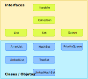

# Tema 7.2: `Collections`

Para hablar de las estructura de datos avanzadas de Java hemos de tener claros varios conceptos.

Necesitamos entender en qué consiste el interfaz `Iterable` y, para ello, hemos de tener claro el concepto de interface.

## Interfaces en Java

Para entender el funcionamiento de las _colecciones_ en java hemos de tener claro el funcionamiento de los **interfaces** (ya que `Collection` es un interfaz que implementan todas las estructura de datos de java).

### Función de un interfaz

Un interfaz define total o parcialmente una serie de métodos. Los métodos son, conceptualmente, la forma en que podemos interactuar con un objeto. De este modo podemos decir que cada interfaz define **una forma de interactuar con un objeto**. El objeto **implementa los métodos necesarios para realizar dicha interacción**.

Estas interacciones en la práctica se concretan en una funcionalidad. Es decir, los métodos que se definen en el interfaz permiten que los objetos que lo implementen sean capaces de realizar una serie de operaciones.

Por ejemplo, los objetos cuya clase implemente el interfaz **iterable** podrán ser **iterados empleando el bucle `for-each`**. Los objetos cuya clase implemente el interfaz **Comparable** podrán ser _ordenados_ usando las funciones de ordenación. etc.

## Interfaces y clases de las colecciones

La jerarquía de interfaces y clases que veremos en este tema es el siguiente:



En primer lugar vemos que todos los elementos que vamos a ver son **iterables** ya que todos heredan de **Collection** y éste a su vez de **Iterable**.

**List**, **Set** y **Queue** son _sub-interfaces_ de **Collection** así que tendrán todas las capacidades de una colección y además cada una de ellas añadirán cualidades propias (las listas tendrán asignadas posiciones a sus elementos, etc.)

## El interfaz `Iterable`

Este interfaz se utiliza para indicar que un objeto puede ser _recorrido_, o lo que es lo mismo, se puede **iterar** sobre él. Las clases que **implementan** el interfaz `Iterable` han de implementar un método (`iterator()`) que permita obtener un objeto `Iterator` que, a su vez, ha de permitir determinar si hemos llegado al final de la _lista_ (`hasNext()`) y obtener un elemento de la _lista_ y avanzar al siguiente (`next()`).

El interfaz `Iterable` utiliza **genéricos** de modo que el iterador podrá aplicarse sobre cualquier tipo de dato (clase) que deseemos.

### El interfaz `Iterator`

Como acabamos de ver el interfaz `Iterable` exige que se implemente un método (`iterator()`) que devuelva un objeto `Iterator`. Este objeto `Iterator` es el que se encarga de recorrer la _lista_ y de devolver los elementos de la misma.

Al igual que el interfaz `Iterable`, el interfaz `Iterator` utiliza **genéricos** de modo que el iterador podrá aplicarse sobre cualquier tipo de dato que deseemos. El tipo de dato que se utilice en el interfaz `Iterator` ha de ser el mismo que se utilice en el interfaz `Iterable`.

Por último `Iterator` exigue que se implementen los siguientes métodos:

* `hasNext()`: Devuelve `true` si quedan elementos por recorrer y `false` en caso contrario.
* `next()`: Devuelve el siguiente elemento de la _lista_ y avanza el iterador al siguiente elemento.

De este modo podemos recorrer una _lista_ usando un bucle while:

```java	
// Creemos primero un iterable como por ejemplo una lista de cadenas:
Lista<String> lista = new ArrayList<String>();
lista.add("Hola");
lista.add("Mundo");
lista.add("!");

// Ahora podremos acceder a su iterador:
Iterator<String> iterador = lista.iterator();

// Y recorrerla usando un bucle while:
while (iterador.hasNext()) {
    System.out.println(iterador.next());
}

// o usando un bucle for:
for (Iterator<String> iterador = lista.iterator(); iterador.hasNext(); ) {
    System.out.println(iterador.next());
}

// o usando un bucle for-each (lo más sencillo en el caso de un iterable):
for (String elemento : lista) {
    System.out.println(elemento);
}
```

Puesto que el **iterador** estará muy ligado a la **colección** que estamos recorriendo, es habitual que se implemente como una **clase interna** de la **colección**.

## El interfaz `Collection`

`Collection` hereda del interfaz `Iterable`. Esto implica que toda clase que implemente `Collection` también ha de implementar los métodos que exige el interfaz `Iterable` (`iterator()`) y, a su vez, hemos de crear una clase que implemente el interfaz `Iterator` que funcione para nuestra _colección_.

Además del método anterior, `Collection`, también exige que se implementen los siguientes métodos:

* `size()`: Indicará el número de elementos que contiene la colección.
* `isEmpty()`: Indicará si la colección está o no vacía.
* `contains(Object o)`: Permite determinar si el objeto `o` se encuentra dentro de la colección.
* `containsAll(Collection c)`: Determina si una colección contiene todos los elementos de la colección `c`. 
* `add(Object o)`: Añade un elemento nuevo `o` a la colección  <b style="color:green">(opcional).</b>
* `addAll(Collection c)`: Igual al anterior pero para una colección de elementos  <b style="color:green">(opcional).</b>
* `remove(Object o)`: Elimina un objeto `o` de la colección  <b style="color:green">(opcional).</b>
* `removeAll(Collection c)`: Igual al anterior pero para una colección de elementos  <b style="color:green">(opcional).</b>
* `clear()`: Elimina todos los elementos de la colección <b style="color:green">(opcional).</b>
* `retainAll(Collection c)`: Mantendrá en la colección únicamente los elementos que también se encuentran en la colección `c` (intersección)  <b style="color:green">(opcional).</b>
* `toArray()`: Devolverá un array conteniendo todos los elementos e la colección.
* `toArray(T[] a)`:  Devolverá un array conteniendo todos los elementos de la colección; el tipo del array devuelto ha de ser el mismo del del array indicado `T`.

En una colección **no hay posiciones**. Sólo podremos añadir o eliminar elementos pero no podremos ni insertar un valor en una posición ni obtener el contenido de una posición. Podríamos decir que una `Collection` es ignorante respecto a **índice** de sus elementos.

## `List`

El interfaz `List` indica que una colección de elementos se encuentra agrupado en forma de lista (existe un orden en el almacenamiento). En una lista podremos acceder a cada elemento indicando su índice o posición dentro de la lista (empezando a contar en cero).

A diferencia de un conjunto, una lista admite elementos duplicados.

Además de los métodos requeridos por el interfaz `Collection`, el interfaz `List` requiere que se implementen los siguientes métodos:

* `T get(int index)`: Nos devolverá el elemento (de tipo T :arrow_right: genéricos) que se encuentra en la posición `index` de la lista (la primera posición de la lista será 0).
* `T set(int index, T element)`: Coloca el valor `element` en la posición `index` de la lista y devuelve el elemento que se encontraba antes en dicha posición.
* `void add(int index, T element)`: Añade o inserta el elemento `element` en la posición `index` de la lista.
* `T remove(int index)`: Elimina el elemento que se encuentra en la posición `index` de la lista y lo devuelve como resultado.
* `int indexOf(Object o)`: Devuelve la posición de la primera aparición del elemento `o` de la lista.
* `int lastIndexOf(Object o)`: Devuelve la posición d
* e la última aparición del elemento `o` en la lista.
* `ListIterator<T> listIterator()`: Devuelve un tipo especial de iterador `ListIterator`.
* `ListIterator<T> listIterator(int index)`: Devuelve un tipo especial de iterador `ListIterator` _apuntando_ a la posición `index` de la lista.
* `List<T> subList(int fromIndex, int toIndex)`: Devuelve una lista conteniendo los elementos desde la posición `fromIndex` (incluyéndola) hasta la posición `toIndex` (excluyéndola).

### `ListIterator`

## `ArrayList`

La clase `ArrayList` implementa una lista de elementos que internamente se almacenan en un array. Esta clase es muy eficiente para acceder a los elementos de la lista ya que se puede acceder a ellos indicando su posición (índice) y no es necesario recorrer la lista para encontrarlos.

A diferencia de un array, el tamaño de un `ArrayList` puede crecer o decrecer dinámicamente. Los elementos de un `ArrayList` pueden ser de cualquier tipo (genéricos).

### Ejemplo de uso

```java
ArrayList<String> lista = new ArrayList<>();

lista.add("Hola");
lista.add("Mundo");
lista.add("Cruel");
lista.add("!");

// Para mostrar el contenido de la lista podemos usar un bucle for-each:
for (String s : lista) {
    System.out.println(s);
}

// O directamente el método toString() de la lista:
System.out.println(lista);

// Podemos acceder a los elementos de la lista indicando su posición:
for (int i = 0; i < lista.size(); i++) {
    System.out.printf("Elemento número %d: %s.%n", i, lista.get(i));
}
```

## `LinkedList`

El funcionamiento de una `LinckedList` es similar al de un `ArrayList` pero internamente no se almacenan los elementos en un array sino en una lista enlazada. Esto hace que **la inserción y eliminación de elementos** sea más eficiente que en un `ArrayList` pero el acceso a un elemento concreto es, en genearl, más lenta.

Si necesitamos guardar una _lista_ de datos que no va a cambiar mucho a lo largo del tiempo pero a la que vamos a acceder con frecuencia, es mejor usar un `ArrayList`. Si, por el contrario, vamos a modificar la lista con más frecuencia de la que vamos a acceder a ella es mejor usar un `LinkedList`.

Resumiendo, el acceso a una posición es _instantánea_ en un `ArrayList` pero dependerá de la posición en un `LinkedList`. La inserción y eliminación de elementos es _lenta_ (algunas veces harbrá que cambia rel tamapño) en un `ArrayList` pero _instantánea_ en un `LinkedList`.

## Colas, interfaz `Queue`

Las colas de Java funcionan como las colas _en el mundo real_. Los elementos se añaden al final de la cola y se extraen del principio: primero en entrar, primero en salir (FIFO: _First In, First Out_).

Las clases que implementen esta interfaz emularán el comportamiento de una cola utilizando los siguientes métodos:

* `boolean add(E e)`: Añade el elemento `e` al final de la cola. Devuelve `true` si se ha podido añadir y **lanzará una excepción** `IllegalStateException` si no hay espacio disponible.
* `boolean offer(E e)`: Inserta el elemento `e` al final de la cola. Devuelve `true` si se ha podido añadir y `false` si no hay espacio disponible.
* `E element()`: Devuelve el primer elemento de la cola. **Lanzará una excepción** `NoSuchElementException` si la cola está vacía. **Sin eliminar el elemento de la cola**.
* `E peek()`: Devuelve el primer elemento de la cola. Devuelve **`null` si la cola está vacía**. **Sin eliminar el elemento de la cola**.
* `E poll()`: Devuelve el primer elemento de la cola. **Devuelve `null` si la cola está vacía**. **Eliminando el elemento de la cola**.
* `E remove()`: Devuelve el primer elemento de la cola. **Lanzará una excepción** `NoSuchElementException` si la cola está vacía. **Eliminando el elemento de la cola**.

Como podemos ver hay dos métodos para cada operación, uno de ellos lanza una excepción si no se puede realizar la operación y el otro devuelve un valor especial para indicar que no se ha podido realizar la operación:

* Inserción de un elemento al final de la cola: `add` lanza una excepción (`IllegalStateException`) si no hay espacio libre (colas con límite de tamaño) y `offer` devolverá falso si no pudo insertar.
* Leer el elemento cabeza de la cola sin sacarlo: `element` lanza una excepción (`NoSuchElementoException`) si la cola está vacía y `peek` devuelve `null` si la cola está vacía.
* Extraer el elemento cabeza de la cola: `remove` lanza una excepción (`NoSuchElementException`) si la cola está vacía y `poll` devuelve `null` si la cola está vacía.

### `PriorityQueue`

La clase `PriorityQueue` implementa el interfaz `Queue`. Además los elementos de la cola se _ordenan_ según su _prioridad_, que se define mediante un objeto `Comparator` que se pasa al constructor de la cola. Si no se pasa ningún `Comparator` se usará el orden natural de los elementos.

Esto **no significa** que los elementos se ordenen automáticamente cuando se añaden a la cola. Los elementos se obtendrán ordenados cuando se extraigan de la cola.

#### Comparadores

Un comparador será un objeto que implemente la iterfaz `Comparator`. Ésta exige que se implemente el método `compare` que recibe dos objetos y devuelve un entero que indica si el primer objeto es menor (menor que 0), igual (0) o mayor que el segundo (mayor que 0).

```java
public class ComparadorInverso implements Comparator<Integer> {
    @Override
    public int compare(Integer i1, Integer i2) {
        return i2 - i1;
    }
}
```

```java
public class Main {
    public static void main() {
        PriorityQueue<Integer> cola = new PriorityQueue<>(new ComparadorInverso());
        cola.add(1);
        cola.add(2);
        cola.add(3);
        cola.add(4);
        cola.add(5);
        cola.add(6);
        cola.add(7);
        cola.add(8);
        cola.add(9);
        cola.add(10);
        while (!cola.isEmpty()) {
            System.out.println(cola.poll());
        }
    }
}

#### Interfaz `Comparator`

Este interfaz le concede a un objeto la capacidad de establecer un orden sobre un tipo de objetos. Para ello, el objeto debe implementar el método `compare` que recibe dos objetos del tipo que se quiere ordenar y devuelve un entero que indica si el primer objeto es menor (menor que 0), igual (0) o mayor que el segundo (mayor que 0).

```java
// Si queremos establecer una cola de prioridad para personas en las que se priorice la edad de menor a mayor:
public class MiComparador implements Comparator<Persona> {
    @Override
    public int compare(Persona p1, Persona p2) {
        return p1.getEdad() - p2.getEdad();
    }
}
```

## Conjuntos, interfaz `Set`

Los conjuntos de Java funcionan como los conjuntos en matemáticas. Los elementos que contiene son únicos y no se pueden repetir. Además, no tienen un orden determinado.

Las clases que implementen esta interfaz emularán el comportamiento de un conjunto utilizando los siguientes métodos:

* `boolean add(E e)`: Añade el elemento `e` al conjunto. Devuelve `true` si se ha podido añadir y `false` si el elemento ya estaba en el conjunto.
* 

### `HashSet`

## `HashMap`

Añadimos por su utilidad este objeto aunque no sea un miembro de esta jerarquía ya que proviene del interfaz `Map`.

Un mapa será una estructura de datos que almacena los mismos en pares **clave** - **valor**. Tanto clave como valor serán objetos cuyos tipos decidimos en el momento de crear nuestro mapa.

Así, si queremos crear un mapa usando como clave valores enteros para almacenar cadenas de textos crearíamos un `HashMap` como:

```java
HashMap<Integer, String> palabras = new HashMap<>();
```

Para añadir elementos a nuestro mapa hemos de usar el método `put(K clave, V valor)`. En nuestro ejemplo:

```java
palabras.put(1, "Uno");
palabras.put(2, "Dos");
// etc.
```
